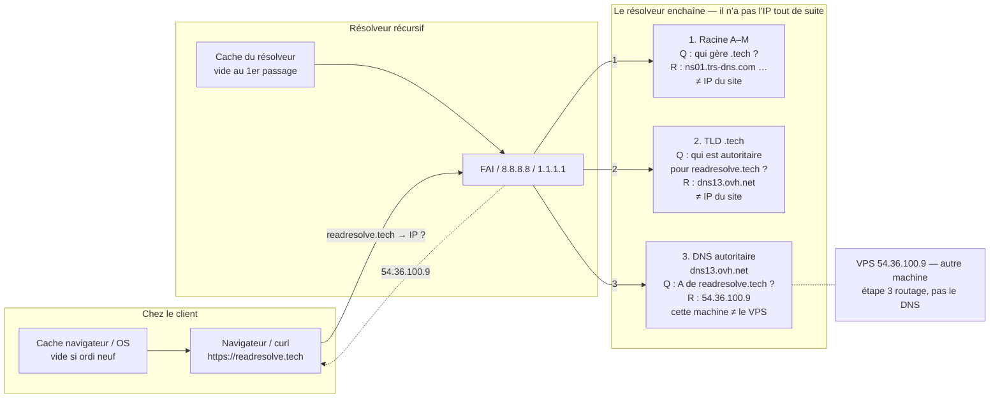

# Schéma corrigé — résolution DNS

Fichier Excalidraw : `dns-resolver-corrige.json`  
Ancien schéma (conservé) : `dns-resolver.json`

Même contenu, lisible ici sans ouvrir Excalidraw.

**Une idée par étage :** 1 et 2 délèguent (noms de serveurs). Seul 3 donne l’IP. Le cache est sur le client et le résolveur, pas sur chaque racine.
