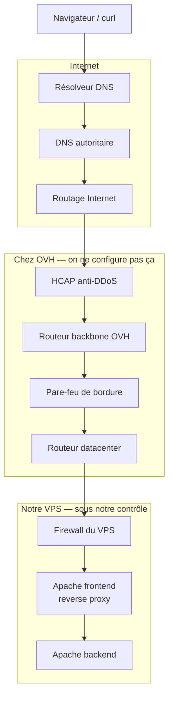

# Intro — le parcours d’une requête

On tape `https://readresolve.tech` dans un navigateur. Une page s’affiche. Entre les deux, la requête traverse plusieurs systèmes : la plupart ne sont **pas** le VPS.

Cette intro donne la **vue d’ensemble**. Les 5 étapes suivantes ouvrent chaque boîte.

## Deux angles, un seul parcours

| Angle | Question | Quand on le traite |
| --- | --- | --- |
| **Accéder** au site | Que se passe-t-il quand on visite l’URL ? | Fil principal des 5 étapes |
| **Héberger / configurer** | Qu’a-t-on dû mettre en place pour que ça marche ? | Surtout l’enregistrement DNS, le firewall VPS, Apache |

L’enregistrement DNS (étape 2) n’est **pas** sur le chemin de la requête : c’est le prérequis. Sans zone DNS, sans IP publique, la résolution de l’étape 1 n’a rien à renvoyer.

## Schéma du parcours complet

Du client jusqu’au contenu, **sans cache**, comme sur un ordinateur tout neuf :



Même enchaînement, forme linéaire :

```
Navigateur / curl
        │
        ▼
Résolveur DNS
        │
        ▼
DNS autoritaire          ←  readresolve.tech  →  54.36.100.9
        │
        ▼
Routage Internet         ←  l’IP est connue, on cherche le chemin
        │
        ▼
HCAP (anti-DDoS OVH)
        │
        ▼
Routeur backbone
        │
        ▼
Pare-feu de bordure
        │
        ▼
Routeur datacenter
        │
        ▼
Firewall du VPS          ←  iptables, règles à nous
        │
        ▼
Apache frontend          ←  reverse proxy, ports publics
        │
        ▼
Apache backend           ←  le client ne lui parle jamais
```

Le navigateur ne connaît **pas** toute cette chaîne. Il connaît un nom, puis une IP, puis il envoie vers cette IP. Le reste est le travail d’Internet et d’OVH.

## Acteurs : qui fait quoi

| Acteur | Rôle | Qui le maîtrise |
| --- | --- | --- |
| Navigateur / `curl` | Demande la page | Nous (le client) |
| Résolveur DNS | Cherche l’IP du nom | FAI ou résolveur public (8.8.8.8, 1.1.1.1) |
| DNS autoritaire | Détient la vérité du domaine | Serveurs de noms (ici OVH : `dns13.ovh.net`, etc.) — **contenu** de la zone : nous |
| Routage Internet | Fait suivre les paquets jusqu’à OVH | Opérateurs (BGP, concept seulement) |
| HCAP, backbone, pare-feu de bordure, routeur DC | Filtrer, acheminer **dans** OVH | OVH |
| Firewall VPS | Accepter ou refuser selon nos règles | **Nous** |
| Apache frontend / backend | Écouter, proxifier, servir | **Nous** |

Tant que le paquet n’a pas passé le firewall du VPS, **Apache n’a encore rien reçu**.

## Lien avec les 5 étapes

1. **Résolution DNS** — comment le nom devient `54.36.100.9`.
2. **Enregistrement DNS** — comment on a déclaré ce lien (zone, records, TTL).
3. **Routage** — comment les paquets trouvent OVH, puis le datacenter.
4. **Firewall** — douane OVH, puis douane du VPS.
5. **Ports et Apache** — qui écoute, et pourquoi un reverse proxy devant le backend.

Les protocoles (TCP, UDP, HTTP, HTTPS) sont une **autre** présentation : ici on les croise (un port 443, un proxy HTTP) sans les démonter.

## Questions à garder en tête

- Quels systèmes interviennent **avant** que le VPS reçoive la requête ?
- Qu’est-ce qui appartient à **OVH** ?
- Qu’est-ce qui est **sous notre contrôle** ?
