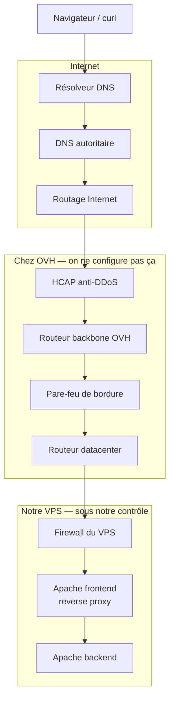

# Intro

Quand on ouvre un site dans un navigateur, une page s’affiche. Entre le clic et le contenu, la requête traverse plusieurs systèmes — et la plupart **ne sont pas** le serveur web.

Cette intro pose d’abord **qui intervient**, puis présente le **cas d’étude** et le **plan** des 5 étapes.

## 1. Les acteurs

Sans parler encore d’un domaine précis : qui fait quoi quand on visite un site ?

| Acteur                           | Rôle                                                             | Qui le maîtrise en général                                                           |
| -------------------------------- | ---------------------------------------------------------------- | ------------------------------------------------------------------------------------ |
| Navigateur / `curl`              | Demande la page                                                  | Le client                                                                            |
| Résolveur DNS                    | Cherche l’IP associée au nom                                     | FAI ou résolveur public (8.8.8.8, 1.1.1.1, …)                                        |
| DNS autoritaire                  | Détient la « vérité » du domaine                                 | Serveurs de noms du registrar / hébergeur — **contenu** de la zone : l’admin du site |
| Routage Internet                 | Fait suivre les paquets jusqu’au réseau de l’hébergeur           | Opérateurs (BGP, concept seulement)                                                  |
| Infrastructure hébergeur         | Anti-DDoS, backbone, pare-feu de bordure, routeurs du datacenter | L’hébergeur                                                                          |
| Firewall du serveur              | Accepter ou refuser selon des règles                             | L’admin du serveur                                                                   |
| Serveur web (frontend / backend) | Écouter, proxifier, servir le contenu                            | L’admin du serveur                                                                   |

Deux questions utiles dès maintenant :

- Qu’est-ce qui appartient à **l’hébergeur** ?
- Qu’est-ce qui est **sous le contrôle** de celui qui gère le site ?

Tant que le paquet n’a pas passé le firewall du serveur, **le serveur web n’a encore rien reçu**.

## 2. Cas d’étude et plan

Fil concret de la présentation :

| Élément               | Détail               |
| --------------------- | -------------------- |
| Hébergement           | VPS chez **OVH**     |
| Domaine               | **readresolve.tech** |
| IP publique (exemple) | `54.36.100.9`        |

### Les 5 étapes

1. **Résolution DNS** — on soumet un nom de domaine dans le navigateur : comment trouve-t-on l’IP ? (résolveur, autoritaires, cache, propagation)
2. **Enregistrement DNS** — d’où vient ce nom ? Comment l’admin du site l’enregistre, déclare la zone, pointe vers l’IP publique (records, TTL)
3. **Routage** — l’IP est connue : comment les paquets arrivent jusqu’au réseau OVH, puis dans le datacenter (BGP en concept, chemin interne OVH)
4. **Infrastructure OVH** — ce qui filtre et achemine **chez OVH** avant notre machine (HCAP / anti-DDoS, backbone, pare-feu de bordure, routeur DC)
5. **Notre configuration** — firewall du VPS (`iptables`), ports et services en écoute, reverse proxy Apache (frontend → backend)

## Questions directrices

- [ ] Quels systèmes interviennent **avant** que le VPS reçoive la requête ?
- [ ] Qu’est-ce qui appartient à **OVH** ?
- [ ] Qu’est-ce qui est **sous notre contrôle** ?
