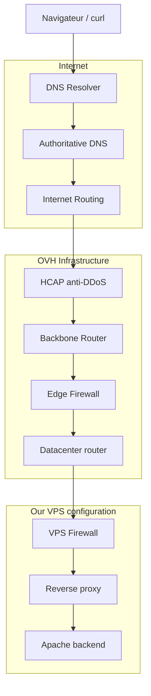

# Intro

## Evocation du cas d'étude

Script :

```
Avec Dominga, Jonathan et Rayann on avait déjà parler du navigateur web et de son fonctionnement, cette fois on a essayer de vous montrer plus en détail comment à partir d’un simple url, on obtient un site web, on va essayer de vous faire comprendre les différents étapes et éléments qui interviennent à chaque fois qu'on consulte un site web.
```

```
On va s'appuyer sur le VPS de la formation pour expérimenter au fur et à mesure. On essaiera d'aérer chaque partie un peu théorique par un peu de pratique.

Première expérience de notre voyage :

Accédons à la page `https://fr.wikipedia.org/wiki/Domain_Name_System`

```

## Explications globales des étapes

Schémas avec responsabilités :



On va découper ce voyage en 5 étapes :

1. **Résolution DNS** — comment le nom devient `54.36.100.9`.
2. **Enregistrement DNS** — comment on a déclaré ce lien (zone, records, TTL).
3. **Routage** — comment les données trouvent le chemin jusqu'au VPS
4. **Infrastructure OVH** - de même le chemin mais aussi les sécurités dans OVH
5. **Configuration du VPS : Ports et Apache** : enfin l'arrivée dans le VPS et la configuration que l'on gère

## Questions directrices

- [x] Quels systèmes interviennent **avant** que le VPS reçoive la requête ?
- [x] Qu’est-ce qui appartient à **OVH** ?
- [x] Qu’est-ce qui est **sous notre contrôle** ?
