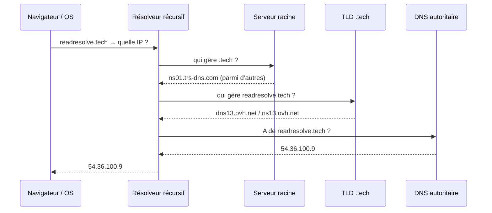

# 1. Résolution DNS

On a une URL : `https://readresolve.tech`. Le navigateur ne sait pas encore où envoyer les paquets. Il lui faut une **adresse IP**.

**Résoudre**, c’est obtenir :

`readresolve.tech` → `54.36.100.9`

Tant que cette IP n’est pas connue, il n’y a **ni** routage, **ni** firewall, **ni** Apache. C’est la première boîte du parcours.

Scénario de cette étape : **sans cache**, ordinateur tout neuf (on vient d’emménager).

L’enregistrement de la zone (comment cette IP a été déclarée) est l’**étape 2**. Ici on observe seulement la **lecture**.

## Schéma — qui interroge qui

Le navigateur ne parcourt pas Internet tout seul. Il pose **une** question à un **résolveur récursif** (souvent celui du FAI, parfois `8.8.8.8` ou `1.1.1.1`). C’est ce résolveur qui enchaîne les serveurs.



Quatre rôles à distinguer :

| Rôle | Question à laquelle il répond | Exemple ici |
| --- | --- | --- |
| **Résolveur récursif** | « Trouve-moi l’IP, je m’occupe du reste » | FAI, Google `8.8.8.8`, Cloudflare `1.1.1.1` |
| **Racine (Root)** | « Qui gère ce TLD ? » | 13 identités **A** à **M**, des milliers d’instances dans le monde |
| **TLD** | « Qui est autoritaire pour ce domaine ? » | `.tech` → `ns01.trs-dns.com`, … |
| **Autoritaire** | « Quelle est **la** réponse pour ce nom ? » | `dns13.ovh.net` / `ns13.ovh.net` |

La racine **ne connaît pas** l’IP de `readresolve.tech`. Elle sait seulement où sont les serveurs `.tech`. Le TLD **ne connaît pas** forcément l’IP non plus : il pointe vers les serveurs de noms du domaine.

## Chaîne réelle : `readresolve.tech`

Première requête, résolveur **vide**.

1. Le résolveur interroge un serveur **racine**. Il ne commence pas forcément par A, puis B : en vrai c’est souvent une **course** (RTT / anycast). `dig +trace` en choisit un, pas forcément le plus proche.
2. La racine répond : TLD **`.tech`** → entre autres `ns01.trs-dns.com` (`64.96.1.1`). Cette délégation `.tech` se met en cache, souvent longtemps.
3. Le résolveur interroge ce TLD : qui est autoritaire pour `readresolve.tech` ?
4. Le TLD répond : `dns13.ovh.net` et `ns13.ovh.net`. Cette délégation se met aussi en cache.
5. Le serveur **autoritaire** répond enfin : **A** `readresolve.tech` → `54.36.100.9` (TTL observé : **3600** s).

```
readresolve . tech
     │         │
     │         └── TLD → ns01.trs-dns.com …
     └── nom   → dns13.ovh.net / ns13.ovh.net
                      └── A → 54.36.100.9
```

Schéma du groupe (conservé) : `excalidraw/dns-resolver.json`.  
Schéma corrigé à projeter : `excalidraw/dns-resolver-corrige.json`.

## Cache — on ne rejoue pas toute la chaîne à chaque clic

Avant d’interroger quiconque, on regarde si la réponse est **déjà là** :

1. Cache du **navigateur**
2. Cache de l’**OS**
3. Cache du **résolveur** (FAI / 8.8.8.8 / …)

D’où la durée : le **TTL** (Time To Live) porté par l’enregistrement. Ici, 3600 s = 1 h pendant lesquelles un résolveur peut réutiliser `54.36.100.9` sans reposer la question à l’autoritaire.

Le cache **accélère** (moins de allers-retours) et **soulage** la racine et les TLD. Contrepartie : une modification DNS n’est pas visible partout au même moment.

## Propagation

**Propagation** : le temps que les caches expirent et que tout le monde revoie la **nouvelle** valeur.

Deux utilisateurs peuvent avoir des réponses **différentes** si :

- leurs résolveurs n’ont pas le même cache (ou pas le même TTL restant) ;
- l’un a encore l’ancienne IP, l’autre a déjà la nouvelle.

Ce n’est pas « Internet qui met 48 h à se mettre à jour » : c’est surtout le **TTL** (détail des types d’enregistrements à l’étape 2).

## Questions à garder en tête

- Qu’est-ce que la propagation DNS ?
- Pourquoi deux utilisateurs peuvent-ils obtenir des réponses différentes ?
- En quoi le cache améliore-t-il les performances ?

Une fois l’IP connue, le navigateur peut **router** vers `54.36.100.9` — étape 3. Mais d’abord : comment cette IP a-t-elle été **déclarée** ? Étape 2.
