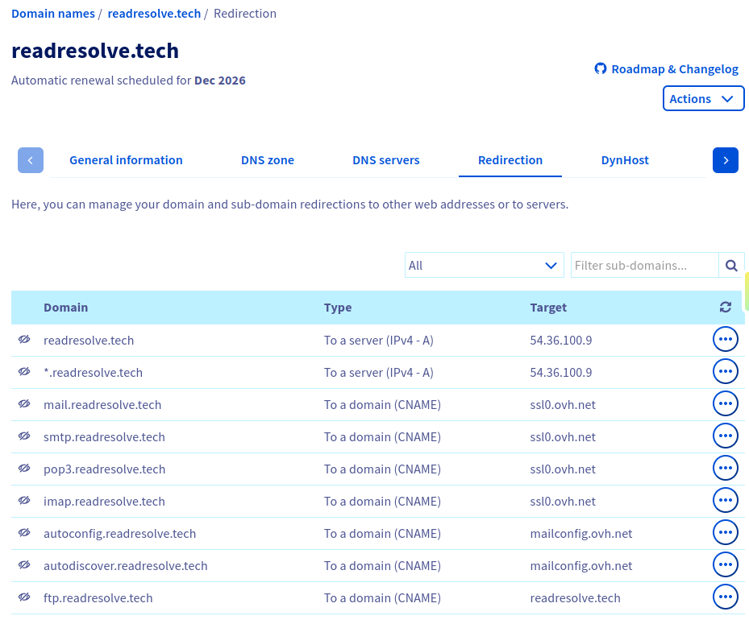

# 2. Enregistrement DNS

> **Rappel :**  
> À l’étape 1, un serveur autoritaire (`dns13.ovh.net`) a répondu : `readresolve.tech` → `54.36.100.9`  
> Cette réponse n’est pas calculée au moment de la requête. Quelqu’un l’a **écrite** avant.

Ici on passe du côté **administrateur** : comment on déclare le lien entre le nom et le VPS.

1. D’une part, il faut réserver le nom (`readresolve.tech`).
2. D’autre part, il faut écrire la liaison entre ce nom et l’IP du VPS — via des **enregistrements** dans la zone DNS, sur les serveurs **autoritaires**.

Avant de revenir au cas d’étude, on pose le vocabulaire : types d’enregistrements, TTL, propagation.

## 2.1. Théorie - Types d’enregistrements

Il existe une grande variété d’enregistrements DNS. Et un point important : **ils ne servent pas qu’au site web**.

Un nom de domaine, ce n’est pas « une page HTTP ». C’est une identité sur Internet, sous laquelle on peut déclarer plusieurs services :

- le **web** (HTTP / HTTPS) → « où est la machine qui sert le site ? »
- le **mail** → « où envoyer les e-mails de ce domaine ? »
- d’autres usages encore (vérifications, règles de sécurité, alias…)

Chaque besoin a son **type** d’enregistrement. Le résolveur demande un type précis : sans le bon type, le nom peut exister… mais ne pas répondre à la question qu’on pose.

On commence par le type le plus central pour la suite : le **NS**.

### NS

**NS** (Name Server) : quels serveurs sont **autoritaires** pour le domaine.

Sans NS, personne ne sait **à qui demander** le reste. C’est le point d’entrée de la zone.

On les a **lus** à l’étape 1 : le TLD nous y envoie. Ici, côté administrateur, on les **écrit** aussi dans la zone. Ce sont eux qui détiennent ensuite la vérité sur le A, le MX, le TXT, etc.

### A et AAAA

Une fois qu’on sait qui est autoritaire, on peut lui faire servir l’essentiel pour le web :

- **A** : nom → adresse **IPv4**
- **AAAA** : même idée en **IPv6**

Sans A (et sans AAAA), le navigateur n’obtient pas d’IP : la résolution de l’étape 1 s’arrête avant le routage.

### CNAME

**CNAME** : alias. Il ne pointe **pas** vers une IP, mais vers **un autre nom**, qui devra lui-même être résolu (souvent jusqu’à un A).

Utile pour coller un sous-domaine à un autre nom (`blog.exemple.com` → `exemple.com`). On ne met en général **pas** de CNAME sur l’apex (`exemple.com` lui-même) : l’apex a déjà NS, MX, etc., et un CNAME ne cohabite pas avec d’autres types sur le même nom.

Deux façons de coller `www` au site : un second **A** (même IP), ou un **CNAME** (« va voir cet autre nom »). Même effet pour le navigateur, sémantique différente dans la zone.

### MX

**MX** pour Mail eXchange : où envoyer les **e-mails** du domaine.

Le site et le mail peuvent vivre sur des machines **différentes**. Le A du web n’achemine pas le courrier.

### TXT

**TXT** : texte libre. Usages courants : prouver qu’on possède le domaine (Google, Let’s Encrypt…), ou des règles mail (**SPF**).

## 2.2. Théorie - TTL et propagation

### 2.2.1. TTL — durée de vie du cache

Chaque enregistrement porte un **TTL** (Time To Live) : combien de **secondes** un résolveur a le droit de **garder** la réponse sans redemander à l’autoritaire.

C’est **nous** qui le choisissons (ou le registrar par défaut) **à l’écriture**. L’étape 1 a montré l’effet à la **lecture** : cache navigateur / OS / résolveur.

Si on change le A (nouvelle IP de VPS) :

- l’autoritaire sert tout de suite la nouvelle valeur ;
- les résolveurs qui ont encore l’ancienne dans le cache attendent la fin du TTL.

D’où : un changement DNS **n’est pas immédiat partout**. Avant une bascule d’IP, on **abaisse** souvent le TTL à l’avance, on attend qu’il expire, puis on change l’IP.

### 2.2.2. Propagation

**Propagation** : le temps que les caches expirent et que tout le monde revoie la **nouvelle** valeur.

Deux utilisateurs peuvent avoir des réponses **différentes** si :

- leurs résolveurs n’ont pas le même cache (ou pas le même TTL restant) ;
- l’un a encore l’ancienne IP, l’autre a déjà la nouvelle.

Ce n’est pas « Internet qui met 48 h à se mettre à jour » : c’est surtout le **TTL**.

## 2.3. Pratique - Notre zone sur les serveurs autoritaires

Retour au cas d’étude.

L’IP `54.36.100.9` n’est pas « le nom de domaine ». C’est l’adresse du VPS. Pour que les résolveurs sachent où envoyer le trafic web, il faut **écrire** cette liaison dans la zone DNS.

Cette zone vit chez les serveurs **autoritaires** déjà vus en lecture : `dns13.ovh.net` et `ns13.ovh.net`. On n’écrit pas sur la racine ni sur le TLD `.tech`. On écrit **le contenu** que ces deux serveurs serviront.

Chez OVH, la console « Redirection » montre une partie de cette configuration — notamment les liaisons nom → IP (A) et nom → autre nom (CNAME) :



On y retrouve notamment :

| Domaine                         | Type (côté OVH)  | Cible              |
| ------------------------------- | ---------------- | ------------------ |
| `readresolve.tech`              | Serveur IPv4 (A) | `54.36.100.9`      |
| `*.readresolve.tech`            | Serveur IPv4 (A) | `54.36.100.9`      |
| `mail`, `smtp`, `pop3`, `imap`… | Domaine (CNAME)  | infra mail OVH     |
| `ftp.readresolve.tech`          | Domaine (CNAME)  | `readresolve.tech` |

Le wildcard `*` fait que tout sous-domaine non listé ailleurs (dont `www`) résout aussi vers `54.36.100.9`. Les records **NS**, **MX**, **TXT** (SPF…), eux, se consultent plutôt dans l’onglet zone DNS — ou directement depuis le terminal.

### En ligne de commane

On lit ce qu’on (ou OVH) a écrit, type par type.

**Windows :**

```powershell
Resolve-DnsName -Name "readresolve.tech" -Type A
Resolve-DnsName -Name "readresolve.tech" -Type AAAA
Resolve-DnsName -Name "readresolve.tech" -Type NS
Resolve-DnsName -Name "readresolve.tech" -Type MX
Resolve-DnsName -Name "readresolve.tech" -Type TXT
Resolve-DnsName -Name "www.readresolve.tech" -Type A
Resolve-DnsName -Name "www.readresolve.tech" -Type CNAME
```

**Linux :**

```bash
dig A readresolve.tech
dig AAAA readresolve.tech
dig NS readresolve.tech
dig MX readresolve.tech
dig TXT readresolve.tech
dig A www.readresolve.tech
dig CNAME www.readresolve.tech
```

À reconnaître au minimum :

| Type  | Attendu ici                                                                  |
| ----- | ---------------------------------------------------------------------------- |
| A     | `54.36.100.9` (TTL souvent 3600)                                             |
| AAAA  | pas d’enregistrement                                                         |
| NS    | `dns13.ovh.net`, `ns13.ovh.net`                                              |
| MX    | serveurs mail OVH (avec une priorité)                                        |
| TXT   | souvent un SPF (`v=spf1 …`)                                                  |
| `www` | **A** vers la même IP — pas un CNAME (couvert par le wildcard ou un A dédié) |

Détail des commandes : [`commands/2-dns-register.md`](../commands/2-dns-register.md).

## Transition

L’IP est connue **et** déclarée. Le navigateur peut l’utiliser pour **trouver le chemin** jusqu’à OVH — étape 3.

## Questions à garder en tête

- [ ] Pourquoi un domaine a-t-il besoin d’enregistrements DNS ?
- [ ] D’où vient l’adresse IP ? Pourquoi identifie-t-elle **ce** VPS ?
- [ ] Plusieurs noms de domaine peuvent-ils pointer vers la même IP ?
- [ ] Que se passe-t-il si l’IP du VPS change ?
- [ ] Qu’est-ce que le TTL ? Qu’est-ce que la propagation DNS ?
- [ ] Pourquoi une modification DNS n’est-elle pas visible tout de suite ?
- [ ] Pourquoi deux utilisateurs peuvent-ils obtenir des réponses différentes ?
- [ ] En quoi le cache améliore-t-il les performances ?
